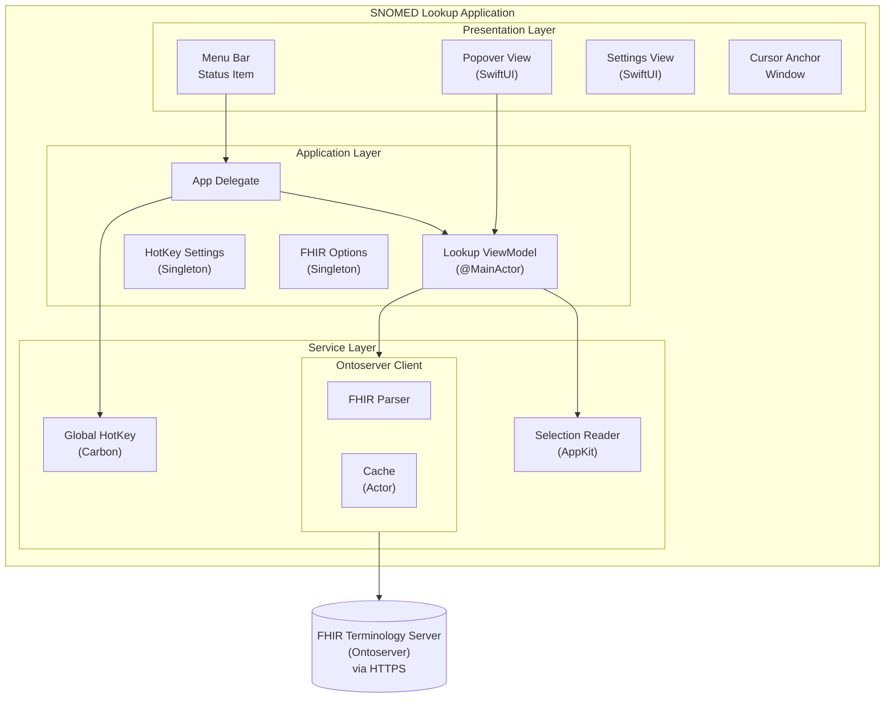
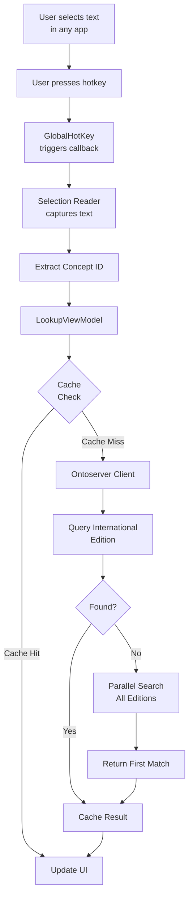
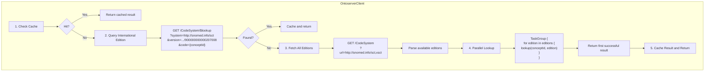

# SNOMED Lookup Architecture

This document describes the technical architecture of SNOMED Lookup, a macOS menu bar application for looking up SNOMED CT concepts.

## Table of Contents

- [Overview](#overview)
- [System Architecture](#system-architecture)
- [Component Details](#component-details)
- [Data Flow](#data-flow)
- [Concurrency Model](#concurrency-model)
- [Caching Strategy](#caching-strategy)
- [Error Handling](#error-handling)
- [Security Considerations](#security-considerations)
- [Dependencies](#dependencies)
- [Design Decisions](#design-decisions)

## Overview

SNOMED Lookup is a lightweight macOS utility that enables users to look up SNOMED CT (Systematized Nomenclature of Medicine - Clinical Terms) concepts from any application using a global hotkey.

### Key Characteristics

- **Menu Bar Application** — Runs as a background process with menu bar presence
- **Global Hotkey** — Responds to system-wide keyboard shortcuts
- **FHIR Integration** — Queries FHIR R4 terminology servers
- **SwiftUI Interface** — Modern declarative UI framework
- **Actor-Based Concurrency** — Thread-safe operations using Swift actors

## System Architecture



## Component Details

### Presentation Layer

#### `SNOMED_LookupApp.swift`
- **Role**: Application entry point (`@main`)
- **Responsibilities**:
  - Define the SwiftUI App structure
  - Configure the Settings scene
  - Add Help menu commands for diagnostics

#### `AppDelegate.swift`
- **Role**: NSApplication delegate
- **Responsibilities**:
  - Set up the menu bar status item
  - Manage the popover lifecycle
  - Register and handle the global hotkey
  - Coordinate lookup triggers
  - React to hotkey setting changes via Combine

#### `PopoverView.swift`
- **Role**: Main result display UI
- **Responsibilities**:
  - Display concept lookup results
  - Show loading and error states
  - Provide copy-to-clipboard buttons
  - Display usage instructions

#### `SettingsView.swift`
- **Role**: Application preferences UI
- **Responsibilities**:
  - Configure global hotkey (key + modifiers)
  - Configure FHIR endpoint URL
  - Toggle debug logging
  - Provide diagnostic export functionality

#### `CursorAnchorWindow.swift`
- **Role**: Invisible anchor for popover positioning
- **Responsibilities**:
  - Create a zero-size window at the cursor location
  - Provide a stable anchor point for the popover

### Application Layer

#### `LookupViewModel.swift`
- **Role**: MVVM view model
- **Responsibilities**:
  - Coordinate between UI and services
  - Manage loading/error states
  - Extract concept IDs from selected text
  - Trigger lookups and publish results
- **Annotations**: `@MainActor` for UI safety
- **Protocols**: Accepts `SelectionReading` and `ConceptLookupClient` for testability

#### `HotKeySettings.swift`
- **Role**: Hotkey configuration singleton
- **Responsibilities**:
  - Store key code and modifiers
  - Persist settings to UserDefaults
  - Convert between NSEvent.ModifierFlags and Carbon modifiers
  - Provide human-readable hotkey description

#### `FHIROptions.swift`
- **Role**: FHIR endpoint configuration singleton
- **Responsibilities**:
  - Store custom FHIR server URL
  - Validate URL format
  - Fall back to default endpoint for invalid URLs
  - Persist settings to UserDefaults

### Service Layer

#### `GlobalHotKey.swift`
- **Role**: System-wide hotkey registration
- **Responsibilities**:
  - Register Carbon event handlers
  - Listen for hotkey events
  - Invoke callback on hotkey press
  - Clean up handlers on deallocation
- **Framework**: Carbon (legacy but required for global hotkeys)

#### `SystemSelectionReader.swift`
- **Role**: System text selection capture
- **Responsibilities**:
  - Snapshot current pasteboard contents
  - Simulate Cmd+C to copy selection
  - Read copied text from pasteboard
  - Restore original pasteboard contents
- **Requirement**: Accessibility permission

#### `OntoserverClient.swift`
- **Role**: FHIR terminology server client
- **Responsibilities**:
  - Query FHIR CodeSystem/$lookup endpoint
  - Fetch available SNOMED CT editions
  - Parse FHIR Parameters responses
  - Manage in-memory cache
  - Handle multi-edition fallback
  - Implement retry with exponential backoff

#### `ConceptCache` (Actor)
- **Role**: Thread-safe result cache
- **Responsibilities**:
  - Store lookup results with timestamps
  - Implement TTL-based expiration
  - Implement LRU eviction at capacity
  - Track access patterns for LRU

### Data Models

#### `ConceptResult`
```swift
struct ConceptResult {
    let conceptId: String      // SNOMED CT identifier
    let branch: String         // Edition name (e.g., "International (20240101)")
    let fsn: String?           // Fully Specified Name
    let pt: String?            // Preferred Term
    let active: Bool?          // Active/inactive status
    let effectiveTime: String? // Version date
    let moduleId: String?      // Module identifier
}
```

#### `SNOMEDEdition`
```swift
struct SNOMEDEdition {
    let system: String   // "http://snomed.info/sct" or "http://snomed.info/xsct"
    let version: String  // Edition URI (e.g., "http://snomed.info/sct/32506021000036107")
    let title: String    // Human-readable name
}
```

#### `OntoserverError`
```swift
enum OntoserverError: LocalizedError {
    case invalidURL(String)           // URL construction failed
    case conceptNotFound(String)      // Concept not in any edition
    case noEditionsFound              // No SNOMED editions available
}
```

## Data Flow

### Lookup Flow



### FHIR API Flow



## Concurrency Model

### Swift Concurrency

The application uses Swift's modern concurrency model:

| Component | Isolation | Reason |
|-----------|-----------|--------|
| `LookupViewModel` | `@MainActor` | UI state updates |
| `HotKeySettings` | `@MainActor` | UI-bound singleton |
| `ConceptCache` | `actor` | Thread-safe data access |
| `OntoserverClient` | None (uses async/await) | I/O-bound operations |

### Parallel Operations

Edition lookups use `TaskGroup` for parallel execution:

```swift
try await withThrowingTaskGroup(of: ConceptResult?.self) { group in
    for edition in editions {
        group.addTask {
            try await self.lookupInSystem(conceptId: conceptId,
                                          system: edition.system,
                                          version: edition.version)
        }
    }

    // Return first successful result
    for try await result in group {
        if let result = result {
            group.cancelAll()  // Cancel remaining lookups
            return result
        }
    }
}
```

## Caching Strategy

### Cache Properties

| Property | Value | Rationale |
|----------|-------|-----------|
| **Type** | In-memory (actor) | Thread-safe, no persistence needed |
| **TTL** | 6 hours | Balance freshness vs. API load |
| **Max Size** | 100 entries | Limit memory usage |
| **Eviction** | LRU (Least Recently Used) | Keep frequently accessed concepts |

### Cache Entry Structure

```swift
struct CacheEntry {
    let result: ConceptResult
    let createdAt: Date       // For TTL calculation
    var lastAccessedAt: Date  // For LRU tracking
}
```

### Cache Operations

- **Get**: Check TTL, update access time, return result
- **Set**: Evict LRU if at capacity, store with timestamps
- **Eviction**: Remove entry with oldest `lastAccessedAt`

## Error Handling

### Error Types

```swift
// Network/API errors
enum OntoserverError: LocalizedError {
    case invalidURL(String)
    case conceptNotFound(String)
    case noEditionsFound
}

// User input errors
enum LookupError: LocalizedError {
    case notAConceptId
    case accessibilityPermissionLikelyMissing
}
```

### Retry Strategy

For transient network failures:

| Attempt | Delay | Total Wait |
|---------|-------|------------|
| 1 | 0s | 0s |
| 2 | 0.5s | 0.5s |
| 3 | 1.0s | 1.5s |

Retryable conditions:
- URLError: timeout, connection lost, DNS failure
- HTTP 5xx server errors

Non-retryable conditions:
- HTTP 4xx client errors
- URL construction failures

## Security Considerations

### Permissions

| Permission | Purpose | Scope |
|------------|---------|-------|
| Accessibility | Read selected text via simulated Cmd+C | On-demand only |
| Network (Outgoing) | FHIR API queries | HTTPS only |

### Data Handling

- **No persistent storage** of user data
- **Clipboard restoration** after reading
- **HTTPS-only** network communication
- **No telemetry** or analytics
- **App Sandbox** enabled

### Privacy

- Selected text is only read when the user explicitly triggers a lookup
- Concept IDs are sent to the FHIR server (no personal data)
- Cache is cleared on app termination

## Dependencies

### System Frameworks

| Framework | Usage |
|-----------|-------|
| SwiftUI | User interface |
| AppKit/Cocoa | Menu bar, pasteboard, windows |
| Carbon | Global hotkey registration |
| Foundation | Networking, data, utilities |
| Combine | Reactive updates for settings |
| os.log | Structured logging |

### External Services

| Service | Purpose | Endpoint |
|---------|---------|----------|
| CSIRO Ontoserver | FHIR terminology server | `https://tx.ontoserver.csiro.au/fhir` |

## Design Decisions

### Why Carbon for Hotkeys?

macOS does not provide a modern API for global keyboard shortcuts. The Carbon `RegisterEventHotKey` API remains the only supported way to register system-wide hotkeys that work in any application.

### Why Simulated Cmd+C for Selection?

macOS restricts direct access to selected text across applications. The Accessibility API allows simulating keyboard events, making Cmd+C the most reliable cross-application method for capturing selections.

### Why FHIR Instead of Direct Snowstorm API?

FHIR provides:
- Standardized response format
- Multi-edition support in a single endpoint
- Broader compatibility with terminology servers
- Better long-term maintainability

### Why Actor for Cache?

Swift actors provide:
- Compile-time thread safety guarantees
- No manual locking required
- Natural async/await integration
- Clear isolation boundaries

### Why Optional Dependency Injection?

The `LookupViewModel` accepts optional dependencies:

```swift
init(selectionReader: SelectionReading? = nil,
     client: ConceptLookupClient? = nil)
```

This allows:
- Default production implementations
- Easy mock injection for testing
- No breaking changes to existing code
