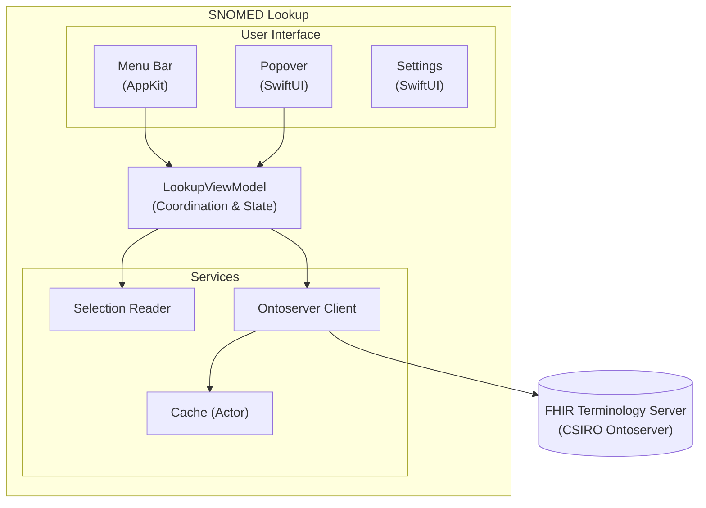

# SNOMED Lookup


A lightweight macOS menu bar utility for looking up **SNOMED CT concept IDs** from anywhere in the system.

Select a SNOMED CT concept ID in any application, press a global hotkey, and instantly see the concept's clinical terminology details in a popover near your cursor.

> **Note:** This is a developer/terminology power tool intended for internal use at CSIRO/AEHRC.

## Table of Contents

- [Features](#features)
- [Requirements](#requirements)
- [Installation](#installation)
- [Usage](#usage)
- [Configuration](#configuration)
- [Architecture](#architecture)
- [Development](#development)
- [Testing](#testing)
- [Privacy](#privacy)
- [Contributing](#contributing)
- [License](#license)

## Features

### Core Functionality
- **Global Hotkey** — Works system-wide in any application (default: `Control+Option+L`)
- **Instant Lookup** — Retrieves concept data from FHIR terminology server in real-time
- **Smart Selection** — Automatically extracts SNOMED CT concept IDs (6-18 digits) from selected text
- **Multi-Edition Search** — Falls back through multiple SNOMED CT editions if concept not found in International

### Display Information
- **Concept ID** — The SNOMED CT identifier
- **FSN** (Fully Specified Name) — The unambiguous clinical term with semantic tag
- **PT** (Preferred Term) — The commonly used clinical term
- **Status** — Whether the concept is active or inactive
- **Edition** — Which SNOMED CT edition contains the concept (with version date)

### User Experience
- **Menu Bar App** — Runs quietly in the menu bar, always accessible
- **Cursor-Anchored Popover** — Results appear near your mouse cursor
- **Copy Utilities** — One-click buttons to copy ID, FSN, PT, or combinations
- **Text Selection** — Results are selectable for easy copying

### Performance & Reliability
- **In-Memory Caching** — 6-hour TTL cache reduces API calls for repeated lookups
- **LRU Eviction** — Cache limited to 100 entries with least-recently-used eviction
- **Retry Logic** — Automatic retry with exponential backoff for transient failures
- **Thread-Safe** — Actor-based concurrency for safe parallel operations

### Configuration
- **Customizable Hotkey** — Choose your preferred key and modifiers
- **Configurable FHIR Endpoint** — Use alternative FHIR terminology servers
- **Debug Logging** — Optional detailed logging for troubleshooting

## Requirements

| Requirement | Details |
|-------------|---------|
| **macOS** | 13.0 (Ventura) or later |
| **Internet** | Required for FHIR terminology server queries |
| **Permissions** | Accessibility (to read text selections) |

## Installation

For detailed installation instructions, see **[INSTALL.md](INSTALL.md)**.

### Quick Start

1. Download the latest build:
   - **Releases**: Download from [Releases](../../releases) (stable)
   - **CI Builds**: Download from [Actions](../../actions) artifacts (latest main branch)
2. Extract and move `SNOMED Lookup.app` to `/Applications`
3. Right-click the app and select **Open** (required for first launch)
4. Grant **Accessibility** permission when prompted
5. The app appears in your menu bar — you're ready to go!

## Usage

### Basic Lookup

1. **Select** a SNOMED CT concept ID in any application
   - Example: `73211009` (Diabetes mellitus)
   - The ID can be embedded in text — the app extracts 6-18 digit numbers automatically

2. **Press** the global hotkey (default: `Control+Option+L`)

3. **View** the concept details in the popover that appears near your cursor

### Copy Options

The popover provides several copy buttons:

| Button | Copies |
|--------|--------|
| **Copy ID** | Just the concept ID |
| **Copy FSN** | The Fully Specified Name |
| **Copy PT** | The Preferred Term |
| **Copy ID & FSN** | Format: `ID \| FSN \|` |
| **Copy ID & PT** | Format: `ID \| PT \|` |

### Keyboard Shortcuts

| Shortcut | Action |
|----------|--------|
| `Control+Option+L` | Lookup selected concept (default, configurable) |
| `Cmd+,` | Open Settings |
| `Cmd+Shift+D` | Copy diagnostics to clipboard |

## Configuration

Access settings via the menu bar icon or `Cmd+,`.

### Hotkey Settings

- **Key**: Choose from L, K, Y, or U
- **Modifiers**: Any combination of Control, Option, Command, Shift

### FHIR Endpoint

- **Default**: `https://tx.ontoserver.csiro.au/fhir`
- Configure a custom FHIR R4 terminology server if needed
- Invalid URLs automatically fall back to the default

### Logging

- **Debug Logging**: Enable for detailed operation logs
- **Copy Diagnostics**: Exports recent logs (15 minutes) to clipboard for troubleshooting

## Architecture

For a detailed technical overview, see **[ARCHITECTURE.md](ARCHITECTURE.md)**.

### High-Level Overview



### Key Components

| Component | Responsibility |
|-----------|----------------|
| `AppDelegate` | Menu bar setup, hotkey registration, popover management |
| `LookupViewModel` | Coordinates selection reading and concept lookup |
| `OntoserverClient` | FHIR API communication, response parsing, caching |
| `SystemSelectionReader` | Captures selected text via simulated Cmd+C |
| `GlobalHotKey` | Carbon-based global hotkey registration |
| `ConceptCache` | Thread-safe LRU cache with TTL expiration |

## Development

### Prerequisites

- **Xcode 15+** with Swift 5.9+
- **macOS 13+** SDK
- Git

### Building

```bash
# Clone the repository
git clone https://github.com/AuDigitalHealth/snomed-lookup.git
cd "snomed-lookup/SNOMED Lookup"

# Open in Xcode
open "SNOMED Lookup.xcodeproj"

# Or build from command line
xcodebuild build -scheme "SNOMED Lookup" -destination "platform=macOS"
```

### Running from Xcode

When running from Xcode, the **built app** (not Xcode itself) needs Accessibility permission:

1. Build and run the project
2. The app will prompt for Accessibility permission
3. If selection capture fails, re-add the app in **System Settings → Privacy & Security → Accessibility**

### Project Structure

```
SNOMED Lookup/
├── SNOMED Lookup.xcodeproj/    # Xcode project
├── SNOMED Lookup/              # Main app source
│   ├── SNOMED_LookupApp.swift  # App entry point
│   ├── AppDelegate.swift       # Application delegate
│   ├── LookupViewModel.swift   # View model
│   ├── PopoverView.swift       # Main UI
│   ├── SettingsView.swift      # Settings UI
│   ├── OntoserverClient.swift  # FHIR client
│   ├── GlobalHotKey.swift      # Hotkey handling
│   ├── HotKeySettings.swift    # Hotkey configuration
│   ├── SystemSelectionReader.swift  # Selection capture
│   └── ...
├── SNOMED LookupTests/         # Unit & integration tests
├── scripts/                    # Build scripts
├── README.md                   # This file
├── INSTALL.md                  # Installation guide
├── PRIVACY.md                  # Privacy policy
├── ARCHITECTURE.md             # Technical architecture
├── CONTRIBUTING.md             # Contribution guidelines
└── CHANGELOG.md                # Version history
```

### Creating a Release

```bash
# Build and package for distribution
./scripts/package-zip.sh

# Output: dist/SNOMED-Lookup-macOS-Release.zip
```

## Testing

### Running Tests

```bash
# Run all tests
xcodebuild test -scheme "SNOMED Lookup" -destination "platform=macOS"

# Run specific test class
xcodebuild test -scheme "SNOMED Lookup" -destination "platform=macOS" \
  -only-testing:"SNOMED LookupTests/ConceptCacheTests"
```

### Test Coverage

| Test Suite | Tests | Coverage |
|------------|-------|----------|
| `ConceptIdExtractionTests` | 20 | Concept ID regex extraction |
| `ConceptCacheTests` | 13 | Cache operations, TTL, LRU eviction |
| `EditionNameParsingTests` | 9 | SNOMED edition URI parsing |
| `OntoserverClientTests` | 10 | FHIR response parsing, error handling |
| `IntegrationTests` | 11 | End-to-end lookup scenarios |
| **Total** | **63** | |

## Privacy

- **Selection Access**: Only reads selected text when the hotkey is pressed
- **Clipboard Restore**: Original clipboard contents are restored after reading
- **No Persistence**: No user data is stored to disk
- **No Telemetry**: No analytics, tracking, or usage data collection
- **Network**: Only HTTPS requests to the configured FHIR server

For complete details, see **[PRIVACY.md](PRIVACY.md)**.

## Contributing

We welcome contributions! Please see **[CONTRIBUTING.md](CONTRIBUTING.md)** for guidelines.

### Quick Contribution Guide

1. Fork the repository
2. Create a feature branch (`git checkout -b feature/amazing-feature`)
3. Make your changes with appropriate tests
4. Ensure all tests pass
5. Submit a pull request

## License

Copyright © CSIRO / Australian e-Health Research Centre (AEHRC)

Internal use only unless otherwise approved. See the source files for detailed copyright notices.

## Acknowledgements

- **CSIRO Ontoserver** — FHIR terminology services
- **SNOMED International** — SNOMED CT terminology standard
